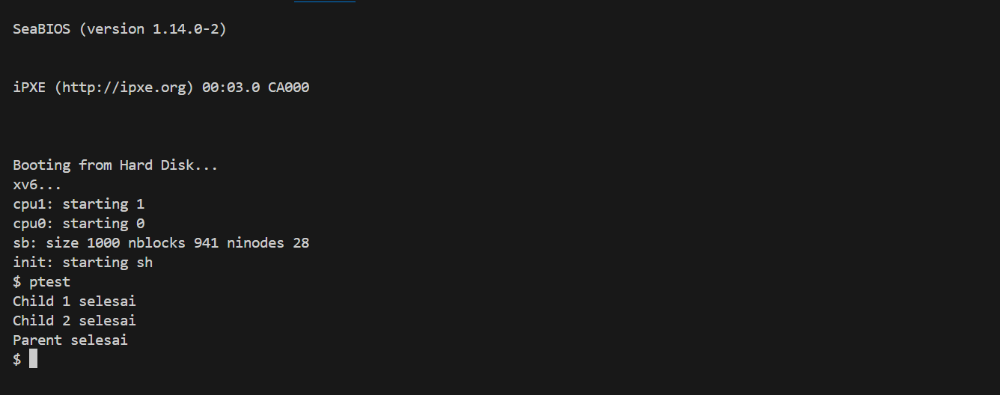

# 📝 Laporan Tugas Akhir

**Mata Kuliah**: Sistem Operasi

**Semester**: Genap / Tahun Ajaran 2024–2025

**Nama**: Tyas Nurshika Damaia

**NIM**: 240202887

**Modul yang Dikerjakan**:
Modul 2 – Penjadwalan CPU Lanjutan (Priority Scheduling Non-Preemptive)

---

## 📌 Deskripsi Singkat Tugas

Tuliskan deskripsi singkat dari modul yang Anda kerjakan. Misalnya:

* **Modul 2 – Penjadwalan CPU Lanjutan (Priority Scheduling Non-Preemptive)**:
  Modul ini bertujuan untuk memodifikasi algoritma penjadwalan proses default xv6 (Round Robin) menjadi Non-Preemptive Priority Scheduling.
Perubahan utama meliputi:

* Menambahkan field priority di setiap proses

* Menambahkan `system call set_priority(int)`

* Memodifikasi fungsi `scheduler()` untuk mengeksekusi proses `RUNNABLE` dengan prioritas tertinggi (nilai numerik paling kecil)

## 🛠️ Rincian Implementasi

* Tambah field `priority` ke dalam `struct proc` di `proc.h`

* Inisialisasi nilai `priority` default di `allocproc()` (`proc.c`)

* Implementasi syscall `set_priority(int)`:

    * Tambahkan nomor syscall (`syscall.h`)

    * Deklarasi di `user.h`, `usys.S`

    * Registrasi dan implementasi di `syscall.c` dan `sysproc.c`

* Ubah algoritma di fungsi `scheduler()` (`proc.c`) agar memilih proses `RUNNABLE` dengan prioritas tertinggi

* Buat program uji `ptest.c`

* Tambahkan `ptest` ke `Makefile`


---

## ✅ Uji Fungsionalitas

Program uji yang digunakan:

* `ptest`: menguji apakah proses dengan prioritas lebih tinggi dijalankan lebih dulu

  * Proses anak 1: `set_priority(90)`

  * Proses anak 2: `set_priority(10)`

  * Output menunjukkan urutan eksekusi berdasarkan prioritas

---

## 📷 Hasil Uji

Lampirkan hasil uji berupa screenshot atau output terminal. Contoh:

### 📍 Contoh Output `ptest`:

```
Child 2 selesai
Child 1 selesai
Parent selesai
```

Jika ada screenshot:

```

### 📸 Screenshot:


```

---

## ⚠️ Kendala yang Dihadapi

* Awalnya lupa menambahkan `release(&ptable.lock);` di akhir `scheduler()` → menyebabkan deadlock

* Salah validasi input pada `sys_set_priority()` (tidak membatasi nilai 0–100) → menyebabkan proses bisa diset ke prioritas negatif

* Debug cukup lama untuk memastikan non-preemptive benar-benar berjalan (tidak ada context switch paksa)

---

## 📚 Referensi

* Buku xv6 MIT: [https://pdos.csail.mit.edu/6.828/2018/xv6/book-rev11.pdf](https://pdos.csail.mit.edu/6.828/2018/xv6/book-rev11.pdf)
* Repositori xv6-public: [https://github.com/mit-pdos/xv6-public](https://github.com/mit-pdos/xv6-public)
* Stack Overflow, GitHub Issues, diskusi praktikum

---
