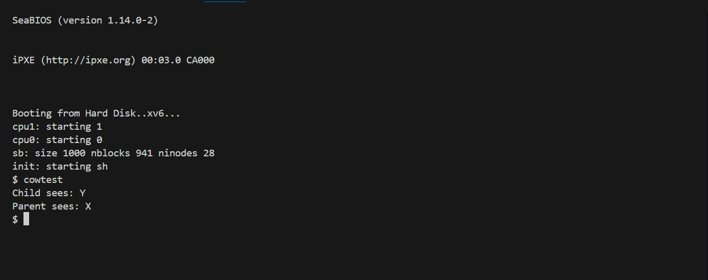
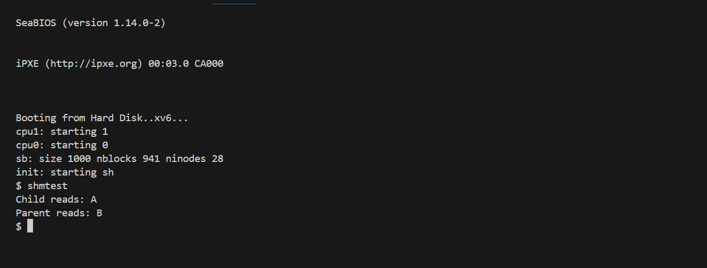

# 📝 Laporan Tugas Akhir

**Mata Kuliah**: Sistem Operasi

**Semester**: Genap / Tahun Ajaran 2024–2025

**Nama**: Tyas Nurshika Damaia

**NIM**: 240202887

**Modul yang Dikerjakan**:
Modul 3 – Manajemen Memori Tingkat Lanjut (xv6-public x86)

---

## 📌 Deskripsi Singkat Tugas

* **Modul 3 – Manajemen Memori Tingkat Lanjut (xv6-public x86)**:
  Modul ini berfokus pada pengembangan manajemen memori lanjutan pada xv6, meliputi dua fitur utama:

1. Copy-on-Write (CoW) pada `fork()` untuk menghindari duplikasi halaman memori yang tidak perlu.

2. Shared Memory ala System V yang memungkinkan proses saling berbagi 1 halaman memori melalui kunci (`key`) dan reference count.

---

## 🛠️ Rincian Implementasi

* Menambahkan `ref_count[]` di `vm.c` untuk melacak jumlah referensi setiap halaman fisik.

* Menambahkan flag `PTE_COW` di `mmu.h`.

* Membuat fungsi `cowuvm()` yang menggantikan `copyuvm()` saat `fork`.

* Menangani page fault (T_PGFLT) di `trap.c` untuk menyalin halaman CoW saat proses melakukan penulisan.

* Membuat tabel shared memory (`shmtab`) dan syscall `shmget()` serta `shmrelease()` di `sysproc.c`.

* Registrasi syscall baru di `syscall.h`, `syscall.c`, `user.h`, dan `usys.S`.


---

## ✅ Uji Fungsionalitas

Program uji yang digunakan:
* `cowtest`: untuk menguji fork dengan Copy-on-Write
* `shmtest`: untuk menguji `shmget()` dan `shmrelease()`

---

## 📷 Hasil Uji

Lampirkan hasil uji berupa screenshot atau output terminal. Contoh:

### 📍 Contoh Output `cowtest`:

```
Child sees: Y
Parent sees: X
```

### 📍 Contoh Output `shmtest`:

```
Child reads: A
Parent reads: B
```

### 📸 Screenshot:




```

---

## ⚠️ Kendala yang Dihadapi

* Kesalahan pada pengelolaan ref_count menyebabkan memori tidak dibebaskan → memory leak.

* Bug ketika pte tidak memiliki flag PTE_COW, sehingga page fault tidak tertangani dengan benar → proses terkill.

* Alokasi memori shared memory gagal karena frame tidak dimapping secara tepat ke user space (USERTOP).

---

## 📚 Referensi

* Buku xv6 MIT: [https://pdos.csail.mit.edu/6.828/2018/xv6/book-rev11.pdf](https://pdos.csail.mit.edu/6.828/2018/xv6/book-rev11.pdf)
* Repositori xv6-public: [https://github.com/mit-pdos/xv6-public](https://github.com/mit-pdos/xv6-public)
* Stack Overflow, GitHub Issues, diskusi praktikum

---
