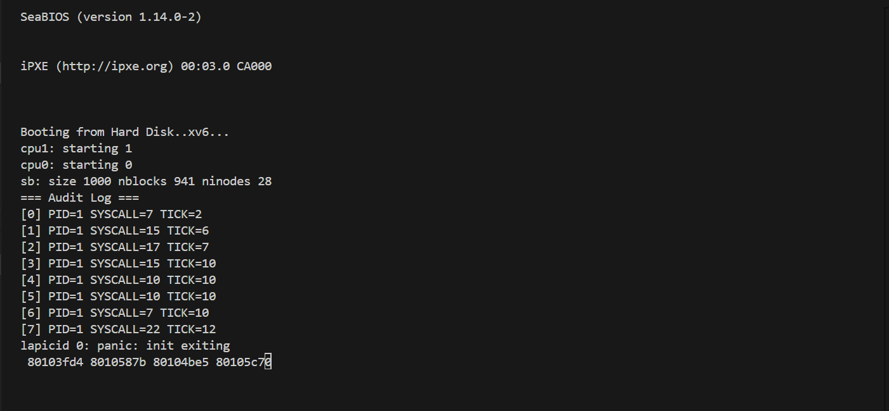
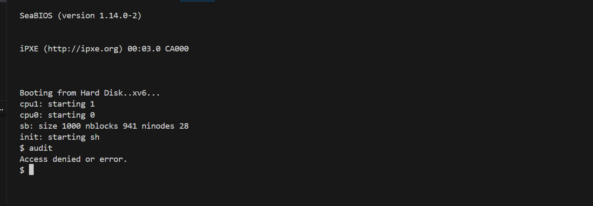

# 📝 Laporan Tugas Akhir

**Mata Kuliah**: Sistem Operasi

**Semester**: Genap / Tahun Ajaran 2024–2025

**Nama**: Tyas Nurshika Damaia

**NIM**: 240202887

**Modul yang Dikerjakan**:
Modul 5 – Audit dan Keamanan Sistem (xv6-public)

---

## 📌 Deskripsi Singkat Tugas

* **Modul 5 – Audit dan Keamanan Sistem**:
Menambahkan mekanisme pencatatan semua system call ke dalam struktur audit log internal kernel. Hanya proses dengan PID 1 yang diizinkan membaca log menggunakan system call `get_audit_log()`.
---

## 🛠️ Rincian Implementasi

* Menambahkan struktur `audit_entry` di `syscall.c`

* Memodifikasi fungsi `syscall()` untuk mencatat setiap pemanggilan system call

* Menambahkan system call baru `get_audit_log()`:

    * Implementasi: `sysproc.c`

    * Deklarasi: `user.h`, `syscall.h`, `defs.h`, `usys.S`

* Menambahkan validasi agar hanya proses PID 1 yang bisa mengakses audit log

* Menambahkan program uji `audit.c`

* Menyesuaikan `Makefile` agar program `audit` dibangun otomatis

---

## ✅ Uji Fungsionalitas

* `audit`: untuk menguji system call `get_audit_log()` dan memastikan hanya bisa diakses oleh proses dengan PID 1.

---

## 📷 Hasil Uji


### 📍 Contoh Output `audit` saat dijalankan sebagai PID 1:

```
=== Audit Log ===
[0] PID=1 SYSCALL=7 TICK=2
[1] PID=1 SYSCALL=15 TICK=6
[2] PID=1 SYSCALL=17 TICK=7
[3] PID=1 SYSCALL=15 TICK=10
[4] PID=1 SYSCALL=10 TICK=10
[5] PID=1 SYSCALL=10 TICK=10
[6] PID=1 SYSCALL=7 TICK=10
[7] PID=1 SYSCALL=22 TICK=12
lapicid 0: panic: init exiting
 80103fd4 8010587b 80104be5 80105c70

```

### 📍 Contoh Output `audit` saat dijalankan oleh proses biasa:

```
Access denied or error.
```


### 📸 Screenshot:






---

## ⚠️ Kendala yang Dihadapi

* Audit log tidak bisa diakses jika `audit` bukan dijalankan oleh PID 1 — perlu memodifikasi `init.c` untuk menjalankan `audit` secara langsung.

* Audit log tidak bersifat circular, jadi jika `audit_index` mencapai `MAX_AUDIT`, data baru tidak akan tercatat.

* Tidak ada locking atau sinkronisasi untuk `audit_index` (potensi race condition jika digunakan di sistem multitasking nyata).

---

## 📚 Referensi

* Buku xv6 MIT: [https://pdos.csail.mit.edu/6.828/2018/xv6/book-rev11.pdf](https://pdos.csail.mit.edu/6.828/2018/xv6/book-rev11.pdf)
* Repositori xv6-public: [https://github.com/mit-pdos/xv6-public](https://github.com/mit-pdos/xv6-public)
* Stack Overflow, GitHub Issues, diskusi praktikum

---
